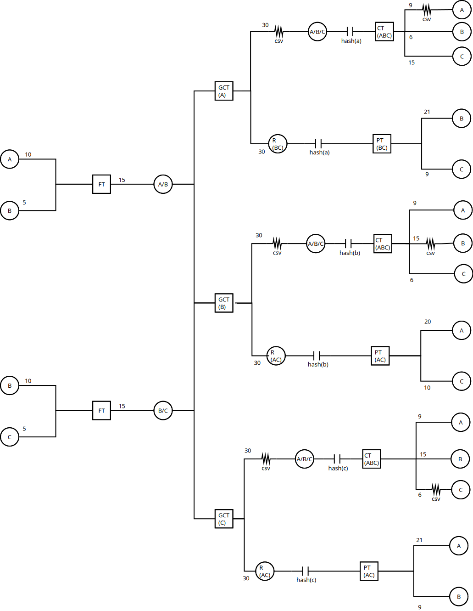
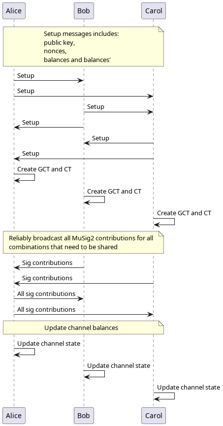

# Introduction

LN was designed before Schnorr signatures and multi party signature
protocols like MuSig were available on bitcoin.

How can we design LN with these new tools available to us?

What if we can do away with HTLCs completely by using signature
aggregation? If a protocol was possible what would look like and what
will be advantages and disadvantages of such a protocol over the
current HTLC based approach?

This document presents one possible construction that uses MuSig2
between multiple channels across parties to make reliable atomic
payments.

# Goals for any new construction

1. Payments should be *atomic* - either all parties update channel
   state, or none do.
2. Payments should be *reliable* - either the sender receives a success
   or a failure. That is, a sender is never left hanging about the
   status of the payment.
3. Payments should be *synchronous* - payment processing should
   complete in under seven seconds for the sender, or it should fail.
4. Payment should not leak information - i.e. payments should help
   retain sender and receiver privacy - even from parties that forward
   the payment.
   
[Continue reading the specs here](./docs/spec.md)

[Github Discussions](https://github.com/pool2win/ln-synctomic/discussions) for
any comments and feedback.

# TL;DR

Input multi channel outputs into a single commitment that can be spent
using MuSig2 signature. See figure below.

<picture>
 
</picture>

A "broadcast" built using unicast over onion routing. Turns out this
is not so expensive. See spec document for details.

<picture>
 
</picture>

